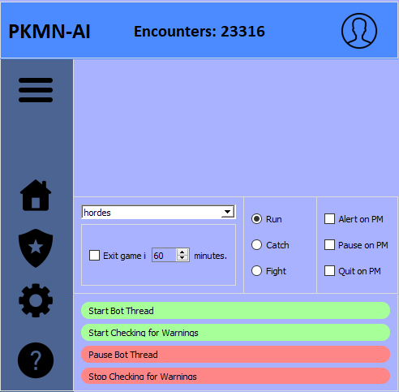
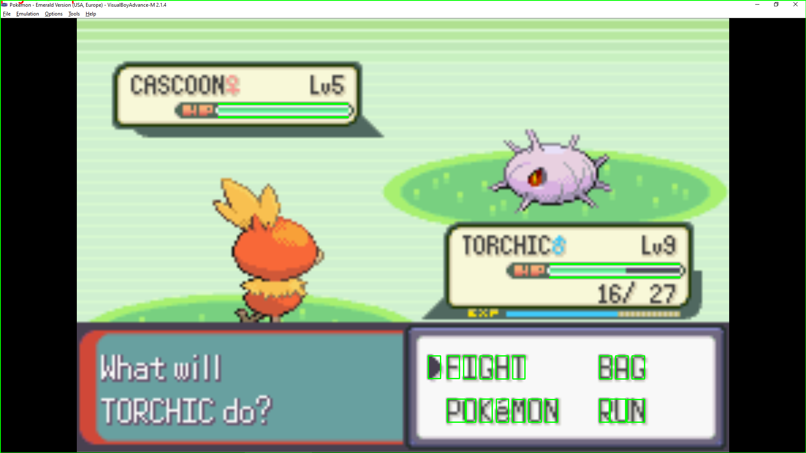

# PKMN-AI

PKMN-AI is an AI that automates the process of playing Pokemon. The script will observe the user's main output device and automatically begin playing the game. It utilizes computer vision and OCR text recognition to play the game and recognize specific Pokemon encounters, which is beneficial for maintaining encounter metrics and data for players.

# Features

- Option to customize the AI for different resoulutions and display settings.
- Works with a multitude of themes, fonts, and MODs.
- Stores encounter data for following sessions/restarts.
- Displays current encounters live on screen in a separate GUI window.

# Prerequisites

macOS/Windows 10+

> The script has only been tested on macOS and Windows 10 currently.

# Compatability & Expectations

> The AI must be able to recognize the text on the screen (small text/fancy fonts may hinder the script).

> The AI must be played on Windowed Mode, but it can be played on any resolution. It cannot be played on Fullscreen Mode (the script can't video capture the game window on Fullscreen Mode).

# Installation

1. Download the latest version of the repository.
2. Install the required python modules by running the following command in your terminal for you virtual environment:

> $ pip install -r requirements.txt

3. Run main.py; create a shortcut if desired.

# Contact & Support

Having Issues? Create a Ticket/Issue here: [Issues](https://github.com/jasonepage/PKMN-AI/issues)
